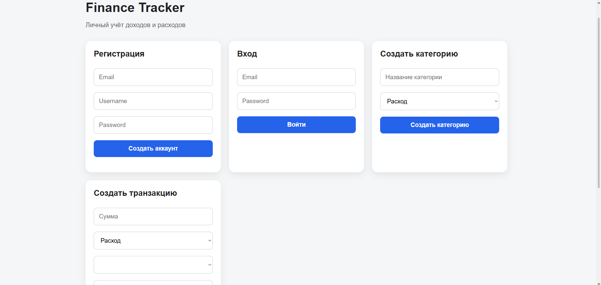
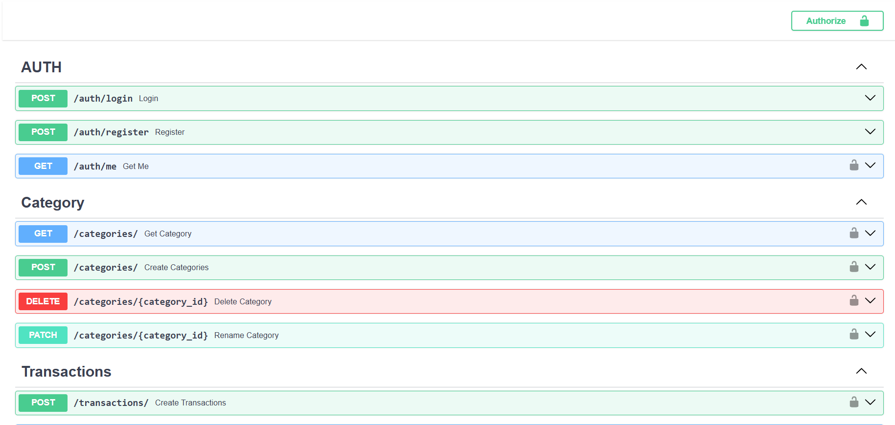

# 💰 Finance Tracker API

REST API для учета личных финансов: доходы, расходы, категории и аналитика.

---

## 🚀 Стек

* Python 3.13
* FastAPI
* SQLAlchemy
* PostgreSQL
* JWT (аутентификация)
* Pytest (тесты)
* Redis (кэширование)

---

## 📦 Функциональность

### ⚡ Кэширование (Redis)
Для ускорения получения категорий используется Redis.

- ключ: categories:user:{user_id}
- TTL: 60 секунд
- данные хранятся в JSON

Кэш инвалидируется при:
- создании категории
- обновлении категории
- удалении категории

### 🧠 Интеграция - AI

* Создал подключение LLM модели
* Вывож данных только по транзакицям действующего пользователя 


### 🔐 Аутентификация

* Регистрация пользователя
* Логин (JWT)
* Получение текущего пользователя (`/auth/me`)

### 📁 Категории

* Создание категории (income / expense)
* Получение списка категорий

### 💸 Транзакции

* Создание транзакции
* Получение списка транзакций
* Фильтрация:

  * по типу
  * по категории
  * по дате

### 🧠 Бизнес-логика

* Нельзя создать транзакцию с типом, отличным от категории
* Пользователь видит только свои данные

---

## ⚙️ Установка и запуск

### 1. Клонировать репозиторий

```bash
git clone <https://github.com/ScandicCon/finance-tracker-api>
cd finance-tracker-api
```

### 2. Создать виртуальное окружение

```bash
python -m venv venv
venv\Scripts\activate
```

### 3. Установить зависимости

```bash
pip install -r requirements.txt
```

### 4. Запустить сервер

```bash
uvicorn app.main:app --reload
```

---
## 🐳 Docker
Проект можно запустить одной командой:

```bash
docker compose up --build

Сервисы:

app (FastAPI)
db (PostgreSQL)
redis (кэш)
frontend (nginx)


## 🧪 Запуск тестов

```bash
pytest
```

---

## 📡 Основные endpoints

### Auth

* `POST /auth/register`
* `POST /auth/login`
* `GET /auth/me`

### Categories

* `POST /categories/`
* `GET /categories/`

### Transactions

* `POST /transactions/`
* `GET /transactions/`

### AI
* `POST /ai/ask`

---

## 🔐 Авторизация

Используется JWT.

Заголовок:

```text
Authorization: Bearer <token>
```

---

## 📊 Пример запроса

```json
POST /transactions/

{
  "amount": "500.00",
  "type": "expense",
  "category_id": 1,
  "description": "Lunch",
  "date": "2026-04-26"
}
```

---

## 📁 Структура проекта

```text
app/
├── models/
├── schemas/
├── servisec/
├── routers/
├── db/
├── frontend/
├── core/
└── main.py

tests/
```

---

## ✅ Что реализовано

* JWT авторизация
* CRUD операции
* Связи между таблицами
* Валидация данных
* Тесты (auth, categories, transactions)

---

## 💡 О проекте

API позволяет пользователям отслеживать доходы и расходы,
структурировать их по категориям и анализировать финансовую активность.

## 🎯 Цель проекта

Пет-проект для демонстрации навыков backend-разработки:

* FastAPI
* работа с БД
* архитектура
* тестирование

---

## 👨‍💻 Автор

🌐 Доступ
-- Frontend: http://localhost:3000

-- Backend: http://localhost:8000
-- Swagger UI: http://localhost:8000/docs


## 📌 Планы по улучшению

- [ ] Alembic миграции  
- [ ] Улучшить frontend (React/Vue)  
- [ ] Добавить pagination  
- [ ] Логирование  
- [ ] CI/CD  
- [ ] Добавление AI Agent
- [ ] Создание tools


Даниил
